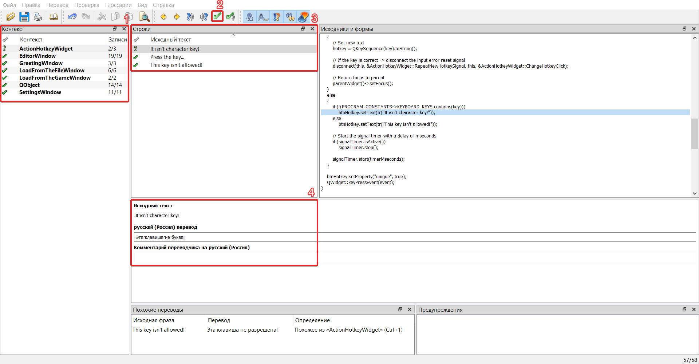

# Translation

GenHotkeys supports Qt's implementation of translations. If you do not have to install Qt 5, feel free to use `Resource\Translations\Tools` tools to edit *.ts files or any text editor that supports xml file format, and compile them to the *.qm files.

On the start editor checks all *.qm files in the `Resources\Translations` folder. Filenames are used to makes win32api request to define full language name by the shortcut and display it in the GUI settings dropdown, i.e. `fr.qm` would be displayed as `French` item in dro

MSDN reference:
1. https://learn.microsoft.com/en-us/windows/win32/api/winnls/nf-winnls-getlocaleinfoex
2. https://learn.microsoft.com/en-us/windows/win32/api/winnls/nf-winnls-enumsystemlocalesex

## How to use `Qt Linguist`

Qt Linguist is an offical Qt tool to translate *.ts translation files.



GUI Reference:

1. List of classes that have translatable strings
2. Accept translation button
3. Strings in class
4. Source string text and its translation

## How to use `lrelease`

lrelease is a simple CLI tool that compiles *.ts files to the *.qm files. To use this tool run command like this:

```cmd
lrelease.exe your-file.ts
```

In result it generates you `your-file.qm` file that could be used as editor translation, if *.qm file would be putted into `Resources\Translations` folder.
